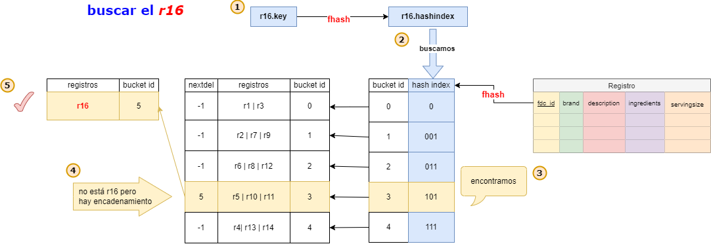

# Proyecto 1: Organización de Archivos

## Introducción 

Entender y aplicar los algoritmos de almacenamiento de archivos físicos y acceso concurrente.
A través de crear y manipular un DataSet usando técnicas de organización de archivos.

### Objetivos
1. **Explorar Diferentes Estrategias de Organización**:
   - Estudiar las particularidades de archivos AVL, ISAM y hashing extensible.
   - Identificar las ventajas y desventajas de cada enfoque de organización.
   - Analizar el rendimiento computacional al implementar bases de datos con estas técnicas.

2. **Implementar Funcionalidades Básicas**:
   - Desarrollar algoritmos de inserción, búsqueda y eliminación para cada método de organización.
   - Comprender la dinámica de interacción entre usuarios y servidores al crear interfaces gráficas (GUI) para la manipulación de bases de datos.
  
### Resultados esperados

1. **Reducción de Accesos a Memoria Secundaria**:
   - Se espera minimizar las lecturas extensas en memoria secundaria al acceder directamente a los datos relevantes a través de índices.

2. **Mejora en la Velocidad de Acceso**:
   - Las consultas y búsquedas se ejecutarán más rápidamente al utilizar índices para localizar rápidamente los datos pertinentes en lugar de recorrer toda la base de datos.

3. **Optimización del Tiempo de Procesamiento**:
   - Operaciones como inserciones, actualizaciones y eliminaciones se realizarán de manera más eficiente al utilizar índices para localizar registros y realizar modificaciones.

4. **Mejora del Rendimiento General**:
   - La indexación mejora el rendimiento y la eficiencia del sistema de gestión de bases de datos, lo que permite manejar cargas de trabajo más grandes y proporcionar una experiencia de usuario más rápida y fluida.

### Técnicas de indexación

Las técnicas usadas para este proyecto son las siguientes:

- [ISAM-Sparse Index](poner link)
- [Extendible Hashing](poner link)
- [AVL](poner link)

### Funciones implementadas

Para cada técnica, se implementó las siguientes funciones:

- vector<Registro> search(T key)
- vector<Registro> rangeSearch(T begin-key, T end-key)
- bool add(Registro registro)
- bool remove(T key)

### DataSet
Hemos usado un dataset de [FoodData Central](https://www.kaggle.com/datasets/pranavkarnani/fooddata-central). Esta elección fue debida a los siguientes factores:

- **Complejidad de los datos**: Ofrece una variedad de información sobre alimentos, como ID, propietario de la marca, descripción, ingredientes, código GTIN/UPC y tamaño de la porción.

- **Tamaño adecuado**: El conjunto de datos es lo suficientemente grande para pruebas exhaustivas y evaluaciones de rendimiento.

- **Relaciones entre datos**: Permite explorar relaciones entre diferentes alimentos y marcas, lo que es útil para entender las estructuras de datos.

- **Variedad de consultas**: Con ingredientes, códigos de barras y descripciones, se pueden realizar diversas consultas para probar las funciones implementadas en las técnicas de organización de archivos.

```c++
struct FoodRecord {
    int fdc_id; //primary key
    char brand[50];
    char description[30];
    char ingredients[110];
    float servingsize;}
```

|       Campo       |                         Descripción                          |
|:-----------------:|:------------------------------------------------------------:|
|   ```fdc_id```    |                   Id único de cada registro.                 |
|    ```brand```    |        Marca del producto, puede ser algún corporativo       |
| ```description``` |                   Descripción del producto                   |
| ```ingredients``` |                   Ingredientes del producto                  |
| ```servingsize``` |               Tamaño de la porción del producto              |

## Técnicas Utilizadas

### AVL File
#### Insert

La función `insert` está diseñada para insertar un nuevo registro en un archivo que implementa un árbol AVL, utilizando una clave específica. 

##### Descripción del Proceso

1. **Verificación de Existencia del Registro**:
   - Se verifica si el registro ya existe en el archivo. Si el registro existe, se muestra un mensaje de error y se cierra el archivo:
     ```cpp
     if (recordExists(file, record, pos_node)) {
         std::cerr << "Record already exists." << std::endl;
         file.close();
         return;
     }
     ```

2. **Inserción del Registro**:
   - Si la posición del nodo es `-1`, se crea un nuevo nodo al final del archivo:
     ```cpp
     if (pos_node == -1) {
         file.seekp(0, ios::end);
         pos_node = file.tellp() / sizeof(Record);
         writeRecord(record, pos_node);
     }
     ```

3. **Manejo de Inserción en un Nodo Existente**:
   - Si hay un nodo en la posición indicada, se lee el nodo actual:
     ```cpp
     else {
         file.seekg(pos_node * sizeof(Record), ios::beg);
         Record node;
         file.read(reinterpret_cast<char*>(&node), sizeof(Record));
     ```
   - Se decide si insertar a la izquierda o a la derecha del nodo actual:
     ```cpp
         if (record.fdc_id < node.fdc_id) {
             if (node.left == -1) {
                 file.seekp(0, ios::end);
                 node.left = file.tellp() / sizeof(Record);
                 file.write(reinterpret_cast<const char*>(&record), sizeof(Record));
             } else {
                 insert(node.left, record);
             }
         } else if (record.fdc_id > node.fdc_id) {
             if (node.right == -1) {
                 file.seekp(0, ios::end);
                 node.right = file.tellp() / sizeof(Record);
                 file.write(reinterpret_cast<const char*>(&record), sizeof(Record));
             } else {
                 insert(node.right, record);
             }
         }
     ```
   - Se actualizan los valores de `left` y `right` del nodo y se reescriben en el archivo:
     ```cpp
         file.seekp(pos_node * sizeof(Record));
         file.write(reinterpret_cast<const char*>(&node), sizeof(Record));
     ```

4. **Actualización y Balanceo del Árbol AVL**:
   - Se actualiza la altura del nodo y se balancea el árbol:
     ```cpp
         updateHeight(node);
         balance(pos_node);
     ```
   - Se escribe el nodo actualizado en el archivo:
     ```cpp
         writeRecord(node, pos_node);
     ```

##### Consideraciones
- **Estructura de Árbol AVL**: La función mantiene la estructura balanceada del árbol AVL, asegurando que las operaciones de inserción y búsqueda sean eficientes.
- **Lectura y Escritura Binaria**: El uso de `fstream` en modo binario asegura una manipulación precisa de los datos del archivo.
- **Robustez**: El código incluye comprobaciones para manejar errores, como la imposibilidad de abrir el archivo de hash y la existencia previa del registro a insertar.

#### Search
La función `search` está diseñada para buscar un registro en un archivo que implementa un árbol AVL utilizando una clave específica. Devuelve el registro encontrado o un registro inválido si no se encuentra la clave.

##### Descripción del Proceso

1. **Verificación de la Posición del Nodo**:
   - Si la posición del nodo es `-1`, lo que indica que el nodo no existe, se retorna un registro inválido:
     ```cpp
     if (pos_node == -1) {
         return Record(-1, "NOT FOUND", "NOT FOUND", "NOT FOUND", 0.0);
     }
     ```

2. **Lectura del Nodo**:
   - Se posiciona el puntero de lectura en la posición del nodo especificada y se lee el contenido del nodo:
     ```cpp
     file.seekg(pos_node * sizeof(Record), ios::beg);
     Record node;
     file.read(reinterpret_cast<char*>(&node), sizeof(Record));
     file.close();
     ```

3. **Comparación de la Clave y Búsqueda Recursiva**:
   - Se compara la clave del nodo leído con la clave buscada:
     ```cpp
     if(node.fdc_id == key) {
         return node;
     }
     ```
   - Si la clave es menor, se busca recursivamente en el subárbol izquierdo:
     ```cpp
     else if(key < node.fdc_id) {
         return find(node.left, key); // busca a la izquierda
     }
     ```
   - Si la clave es mayor, se busca recursivamente en el subárbol derecho:
     ```cpp
     else {
         return find(node.right, key); // busca a la derecha
     }
     ```

##### Consideraciones 
- **Estructura de Árbol AVL**: La función recorre el árbol AVL de manera eficiente, utilizando la propiedad de balance del árbol para reducir el número de comparaciones necesarias.
- **Lectura Binaria**: El uso de `fstream` en modo binario asegura una lectura precisa de los datos del archivo, garantizando que los registros se lean correctamente.
- **Robustez**: El código incluye comprobaciones para manejar errores, como la inexistencia del nodo y la imposibilidad de abrir el archivo, proporcionando registros especiales en esos casos.

#### Seacrh for Range
La función `rangeSearch` está diseñada para buscar todos los registros en un archivo que implementa un árbol AVL cuyas claves están dentro de un rango específico. La función toma como parámetros la posición del nodo (`pos_node`), los límites inferior (`lower`) y superior (`upper`) del rango, y un vector (`results`) donde se almacenarán los registros que caen dentro del rango.

##### Descripción del Proceso

1. **Verificación de la Posición del Nodo**:
   - Si la posición del nodo es `-1`, lo que indica que el nodo no existe, se retorna de la función:
     ```cpp
     if (pos_node == -1) return;
     ```

2. **Lectura del Nodo**:
   - Se lee el registro del nodo en la posición especificada:
     ```cpp
     Record node;
     readRecord(node, pos_node);
     ```

3. **Recorrido del Subárbol Izquierdo**:
   - Si hay un subárbol izquierdo y el límite inferior es menor o igual que la clave del nodo actual, se realiza una búsqueda recursiva en el subárbol izquierdo:
     ```cpp
     if (node.left != -1 && lower <= node.fdc_id) {
         rangeSearch(node.left, lower, upper, results);
     }
     ```

4. **Verificación y Almacenamiento del Nodo Actual**:
   - Si la clave del nodo actual está dentro del rango especificado, se agrega el nodo a los resultados:
     ```cpp
     if (node.fdc_id >= lower && node.fdc_id <= upper) {
         results.push_back(node);
     }
     ```

5. **Recorrido del Subárbol Derecho**:
   - Si hay un subárbol derecho y el límite superior es mayor o igual que la clave del nodo actual, se realiza una búsqueda recursiva en el subárbol derecho:
     ```cpp
     if (node.right != -1 && upper >= node.fdc_id) {
         rangeSearch(node.right, lower, upper, results);
     }
     ```

#### Consideraciones

- **Estructura de Árbol AVL**: La función aprovecha la estructura balanceada del árbol AVL para realizar búsquedas eficientes en rangos, explorando solo las ramas del árbol que pueden contener valores dentro del rango especificado.
- **Lectura Binaria**: El uso de `fstream` en modo binario asegura una lectura precisa de los datos del archivo, garantizando que los registros se lean correctamente.
- **Recursividad**: La función utiliza llamadas recursivas para explorar las ramas izquierda y derecha del árbol, asegurando que todos los nodos dentro del rango sean visitados y agregados a los resultados.


#### Remove

La función `remove` está diseñada para eliminar un registro de un archivo que implementa un árbol AVL utilizando una clave específica. La función toma como parámetros una referencia a la posición del nodo (`pos_node`) y la clave (`key`) del registro a eliminar.

#### Descripción del Proceso

1. **Verificación de la Posición del Nodo**:
   - Si la posición del nodo es `-1`, lo que indica que el nodo no existe, se retorna de la función:
     ```cpp
     if (pos_node == -1)
         return; // Nodo no encontrado, terminar.
     ```

2. **Lectura del Nodo**:
   - Se lee el registro del nodo en la posición especificada:
     ```cpp
     Record node;
     file.seekg(pos_node * sizeof(Record), ios::beg);
     file.read(reinterpret_cast<char*>(&node), sizeof(Record));

     if (!file) {
         std::cerr << "Failed to read from file at position " << pos_node << std::endl;
         file.close();
         return;
     }
     ```

3. **Recursión para Encontrar el Nodo a Eliminar**:
   - Si la clave es menor que la clave del nodo actual, se llama recursivamente para el subárbol izquierdo:
     ```cpp
     if (key < node.fdc_id) {
         remove(node.left, key); // Llama recursivamente para la izquierda.
     }
     ```
   - Si la clave es mayor que la clave del nodo actual, se llama recursivamente para el subárbol derecho:
     ```cpp
     else if (key > node.fdc_id) {
         remove(node.right, key); // Llama recursivamente para la derecha.
     }
     ```

4. **Eliminación del Nodo Encontrado**:
   - Si el nodo tiene un solo hijo o ningún hijo, se ajusta la referencia del nodo:
     ```cpp
     else {
         if (node.left == -1 || node.right == -1) {
             long tempPos = (node.left != -1) ? node.left : node.right;

             if (tempPos == -1) {
                 pos_node = -1; // No hay hijos elimina el nodo.
             } else {
                 Record tempNode;
                 file.seekg(tempPos * sizeof(Record), ios::beg);
                 file.read(reinterpret_cast<char*>(&tempNode), sizeof(Record));
                 if (!file) {
                     std::cerr << "Failed to read from file at position " << tempPos << std::endl;
                     file.close();
                     return;
                 }
                 node = tempNode;
                 pos_node = tempPos;
             }
         }
     ```

   - Si el nodo tiene dos hijos, se encuentra el sucesor in-order (el nodo con el valor mínimo en el subárbol derecho), se copia su valor al nodo actual y se elimina el sucesor:
     ```cpp
         else {
             long succPos = minValueNode(node.right);
             Record succNode;
             file.seekg(succPos * sizeof(Record), ios::beg);
             file.read(reinterpret_cast<char*>(&succNode), sizeof(Record));
             if (!file) {
                 std::cerr << "Failed to read from file at position " << succPos << std::endl;
                 file.close();
                 return;
             }
             node.fdc_id = succNode.fdc_id; // Copia el sucesor aquí.
             strcpy(node.brand, succNode.brand);
             strcpy(node.description, succNode.description);
             strcpy(node.ingredients, succNode.ingredients);
             node.servingsize = succNode.servingsize;

             remove(node.right, succNode.fdc_id);
         }
     ```

5. **Actualización y Balanceo del Árbol AVL**:
   - Si el nodo no se ha eliminado, se actualiza su altura y se balancea el árbol:
     ```cpp
     if (pos_node != -1) {
         updateHeight(node);
         balance(pos_node);

         file.seekp(pos_node * sizeof(Record), ios::beg);
         file.write(reinterpret_cast<char*>(&node), sizeof(Record));
         if (!file) {
             std::cerr << "Failed to write to file at position " << pos_node << std::endl;
         }
     }
     ```

##### Consideraciones 
- **Estructura de Árbol AVL**: La función mantiene la estructura balanceada del árbol AVL después de la eliminación de un nodo, asegurando que las operaciones de búsqueda y actualización sigan siendo eficientes.
- **Lectura y Escritura Binaria**: El uso de `fstream` en modo binario asegura una manipulación precisa de los datos del archivo.
- **Recursividad**: La función utiliza llamadas recursivas para encontrar y eliminar el nodo, así como para balancear el árbol después de la eliminación.

### ISAM-Sparse Index
#### Insert

1. **Caso base**
    - En nuestro caso base es cuando el indexpage no está lleno, para esto creo un next indexpage en el cual escribo el record e igualmente para el datapage
 ```cpp
   file.seekg(4+1, ios::beg); 
   if(ip0.n!=ip0.MI-1){ 
   isam::IndexPage<T> ipn; 
   ip0.pages[-1]=ipn;
   sort();
    file.seekg(ipn*(sizeof(IndexPage)+1), ios::beg); 
    file.write(reinterpret_cast<const char*>(&k), sizeof(Record));
```
- Luego procedo a crear mi datapage para añadir el record en el datapage 
```cpp
    ifstream dfile(dfile, ios::app | ios::binary | fstream::out);
    isam::DataPage dpn;
    dfile.seekg((4+1)+(1+sizeof(DataPage))*ipn, ios::beg);
    dfile.write(reinterpret_cast<const char*>(&k), sizeof(Record));
 ```
2. **Caso general**
    - Hago un binary search para hallar el mayor key a k y obtener la posición donde insertar mediante binarysearch aprovechando que el indexpage está ordenado para poder ubicar mejor key en forma logarítmica.
```cpp
   file.seekg(4+1, ios::beg);
   file.read(ip0,sizeof(IndexPage));
               
   while(beg<=final) {
       int i=0;
       int mid=(beg+final)/2;
               
       if(k==ip0.keys[mid]){
           return mid;
           file.close();}
       if(k<=ip0.keys[mid]){
           final=mid-1;}
      else if(k>=ip0.keys[mid]){
           beg=mid+1; }
       }
   long x=ip0.pages[beg]; 
```
3. **Uso del 2ndo nivel de IndexPage**
    - Para esto, obtengo la posición actual del binary search del paso 2 y me posiciono en el 2ndo nivel de IndexPage y uso su dataPage
```cpp
   file.seekg((4+1)+(x*(sizeof(IndexPage)+1)), ios::beg); 
   isam::IndexPage <T> ipx;
   if(ipx.n!=ipx.MI-1){
       isam::DataPage dpn; 
       ipx.pages[x]=dpn;}
   
   else{
       fstream dfile(dfile, ios::app | ios::binary | fstream::out);
       file.seekg((4+1)+(1+sizeof(DataPage))*ipx, ios::beg);
       isam::DataPage dp; 
               
       int beg=0;
       int final=dp.n;
       //{...} Realizo un binary search para hallar el primer mayor a k y
       //obtener la posición de página
       long dpn=dp.record[beg]; 
```
- Ahora uso la datapage encontrada mediante el binary-search del paso anterior para ubicar el registro dentro del datapage. Hay que considerar que para la función insert estamos usando `free list` para tomar en cuenta un espacio de nextdel

```cpp
if(dp.n!=dp.MD-1){
    int pos=dp.nextdel;
    dfile.seekg((4+1)+(1+sizeof(DataPage))*pos, ios::beg);
    dfile.write(reinterpret_cast<const char*>(&k), sizeof(Record));  }
else{
    isam::DataPage dpe; 
    isam::DataPage lastelem=dpn.records[-1]; //ultimo elemento
    lastelem.nextPage=dpe; //su nextpage será el dpe
    dpe.write(reinterpret_cast<const char*>(&k), sizeof(Record)); }
    }
```
##### Consideraciones 
- **Lectura y Escritura Binaria en IndexPage**: Debido a que el IndexPage está ordenado, es efectivo el uso de búsqueda binaria tanto para el 1er nivel y el 2do.
- **Inserción en el DataPage**: En cuanto la implementación del datapage, debudo a que no será ordenado, se maneja de como un heapfile, es decir que todos los nuevos Records se insertan al final. Además, se toma en cuenta la implementación de un freelist para insertar donde hay espacios de registros eliminados y tener mejor uso de espacio.

#### Search
La función `search` está diseñada para buscar un registro en un archivo que se encuentra dentro de un datapage utilizando una clave específica. Devuelve el registro encontrado o un registro inválido si no se encuentra la clave.

##### Descripción del Proceso

1. **Binary Search en IndexPage**:
   - Debido a que el IndexPage está ordenado, se realiza una búsqueda binaria en el primer nivel para hallar el 2do nivel de IndexPage:
     ```cpp
     file.read(sizeof(IndexPage), ip);

        while(beg<=final) {
            int i=0;
            int mid=(beg+final)/2;
            
            if(key==ip.keys[mid]){
                return mid;
                file.close();}
            if(key<=ip.keys[mid]){
                final=mid-1;}
            else if(key>=ip.keys[i]){
                beg=mid+1;}
        }
        return ip.pages[beg];
     ```

2. **Binary Search en 2ndo nivel**:
   - Primero ubicamos el IndexPage a partir de la página que nos retorno el paso 1 y ubicamos la página del 2ndo nivel perteneciente al indexfile.
   - Posteriormente se aplica binary search de nuevo
     
     ```cpp
        file.seekg(p2*(sizeof(IndexPage)+1), ios::beg); 
        file.read(ip,sizeof(IndexPage))
        //binarysearch del paso 1
        long ip3=indexPage.pages[beg];
     ```

3. **Acceso al datapage y obtención de key**:
   - A partir del ip3 que nos indica la página enlazada del indexPage obtenedremos la ubicación del datapage :
     ```cpp
        ifstream file(dfile, ios::app | ios::binary | fstream::out);
        isam::DataPage dataPage;
        file.seekg((4+1)+(1+sizeof(DataPage))*ip3, ios::beg);
        
     ```
   - Procedemos a hacer una búsqueda lineal dentro del datapage para hallar la key
     ```cpp
        int i=0;
        while(dataPage.records[i]!=key){
            i++;}
     ```
##### Consideraciones 
- **Búsqueda Binaria:** Observamos que al ser un IndexPage, tomamos ventaja que está organizado en sus 2 niveles
- **Búsqueda lineal**: La única parte donde del ISAM donde la búsqueda es lineal es el Datapage dado que este no está ordenado.


#### Search for Range
1. **Binary Search en IndexPage con llaves de inicio y fin**:
   - Debido a que el IndexPage está ordenado, se realiza una búsqueda binaria en el primer nivel para hallar el 2do nivel de IndexPage usando las llaves y se insertan los IndexPages que están en el rango:
     ```cpp
     isam::IndexPage<T> ip; 
    vector <isam::IndexPage<T>> vindex_primernivel; 
    while(beg<=final) {
            int mid=(beg+final)/2;
            
            if(ip.keys[mid]>=kinicio && ip.keys[mid]<=kfinal){
                vindex_primernivel.push_back(ip.keys[mid]);}
            else if(ip.keys[mid]>=kinicio && ip.keys[mid]>=kfinal){
                final=mid-1;}
            else if(ip.keys[mid]<=kinicio && ip.keys[mid]<=kfinal){ 
                beg=mid+1;}
        }
        return vindex_primernivel;
        
     ```

2. **Binary Search en 2ndo nivel y dentro de DataPage**:
   - A partir del array de IndexPages, iteramos sus elementos y dentro de cada uno para acceder a sus datapages
     
     ```cpp
        for(int i: vindex_primernivel){ //aca guardo los keys de primer nivel
            for (int element: vindex_primernivel[i]){ 
            //Itero sobre los elementos del primer nivel (segundo nivel)
    
     ```
    - Para empezar, debemos obtener el índice desde dónde vamos a empezar a copiar los elementos
    ```
    if(element=0){ 
        fstream dfile(dfile, ios::app | ios::binary | fstream::out);
        file.seekg((4+1)+(1+sizeof(DataPage))*vindex_primernivel[i][element], ios::beg);
        isam::DataPage dp; 

        if(vindex_primernivel[i][element]<=kfinal && vindex_primernivel[i][element]>=kinicio){
            vfinal.push_back(dp.records[j])
            j++;
        }
    ```
    - El segundo caso, es para los elementos que están pasando el inicial pero aún no están en el último indexPage, para estos, solo los agregamos al vector
    ```
    while(j<=final){
        vfinal.push_back(dp.records[j])
    }
    ```
    - El tercer caso es cuando estamos en el último indexPage, para este tenemos un límite de hasta dónde copiar los elementos
```
    else if (element+1>=kfinal){ //si el 2ndo nivel supera mi kfinal
        fstream dfile(dfile, ios::app | ios::binary | fstream::out);
        isam::DataPage dp; 
        file.seekg((4+1)+(1+sizeof(DataPage))*vindex_primernivel[i][element], ios::beg);
        int j=0;
        while(vindex_primernivel[i][element]<=kfinal){
            vfinal.push_back(dp.records[j])
            j++;}
    }
```
##### Consideraciones 
- **Uso de vectores:**: Se guardaron los IndexPages que pertenecían al rango de las llaves para luego poder verificar sus elementos del vector. Posterioremente se itera dentro de cada IndexPage para acceder a las páginas del segundo nivel que estas dirigen. 
- **3 Casos de búsqueda por rango**: Tomamos en cuenta 3 casos, en el cual, el primero es para encontrar nuestra primera llave a buscar. El 2do caso es para copiar todos los elementos que se encuentren dentro del rango. El último es para ubicar nuestro último elemento a insertar en el vector.


#### Remove

### Extendible Hash
Estructuras necesarias para la implementación:
#### AdressRecord  
Nos ayuda a mantener la relación entre hash_index y bucket_id necesaria para el archivo **adress_table.dat**.  
**¿Por qué decidimos almacenar el hash_index en un vector<char>?**  
Porque cada vez que se realiza un split se necesita modificar el hashindex (en este caso por adelante ya que trabajamos con sufijos, es decir empezando desde la derecha) y también al momento de encontrar el hashindex que coincida con el ingresado, debemos hacer uso de posiciones en el hashindex almacenado, según su **d** (profundidad local del hashindex). Para simplificar ese trabajo lo declaramos de esa manera
```cpp
struct AdressRecord {
    vector<char> hash_index; // tamaño D, incializado en los constructores
    int bucket_id = 0;
    int d = 0;
//...
```
#### Bucket  
Estructura donde guardamos una cantidad máxima de *fb* Records y datos necesarios para su inserción, búsqueda y eliminación, como lo son: bucket_id, next_bucket, size, etc.  

```cpp
template<typename T>
struct Bucket {
    int bucket_id;
    Record<T> records[fb];
    int next_bucket;
    int size;
    int local_d;
```

#### Insert
Al insertar un Record en nuestro **ExtendibleHash** seguimos pasos para caso posible: sin overflow, con overflow o con encadenamiento. 

Primero obtenemos el *hash_index* de la key del Record, para así poder obtener el *bucked_id* según ese hash, teniendo en cuenta la profundidad del hash (que sea <= D (profundidad global)).
```cpp
 void insert(Record<T> record) {
    vector<char> rhindex = fhash(record.key);
    int bkid = get_bucket_id(rhindex, adressT);
//...
}
```
Con la función **get_bucket_id** buscamos el id correspondiente al bucket asignado al hash que coincide con el hash del key. Ésta búsqueda se realiza en el archivo ***address_table.dat***,el cual tiene la estructura:   
n_buckets: Cantidad de buckets asignados a un hashindex en ***address_table.dat***.  
n_overflow: Cantidad de buckets con overflow de encadenamiento.  
<p align="center">
   
|   Cabecera    | 
|:-------------:|
|   n_buckets   | 
|   n_overflow  | 

|   HashIndex   |  Buckect_id  |
|:-------------:|:------------:|
|        0      |       0      |
|        01     |       1      |
|        11     |       2      |

</p>
Dentro de esta función hacemos un llamado a la función auxiliar **same_index** la cual nos regresa el booleano de la relación entre el hash_index ingresado y el hash_index relacionado a cada bucket_id en **address_table.dat**.  

```cpp
int get_bucket_id(vector<char> hindex, string adressT) {
    int id; 
    ifstream adressTFile(adressT, ios::binary);
    if (!adressTFile) {
        cerr << "No se pudo abrir el archivo " << adressT << " para lectura." << endl;
        return -1;
    }
    int cant_arecords;
    adressTFile.seekg(0);
    adressTFile.read((char*)&cant_arecords, sizeof(int));
    AdressRecord temp;
    for (int i = 0; i < cant_arecords; ++i) {
        temp.hash_index.clear();
        //leemos los AdressRecord
        for (int j = 0; j < D; ++j) {
            char ch;
            adressTFile.read(&ch, sizeof(char));
            temp.hash_index.push_back(ch);
        }
        adressTFile.read((char*)&temp.bucket_id, sizeof(int));
       //si el índice coincide, extraemos el id para retornar : )
        if (same_hindex(temp.hash_index, hindex)) {
            adressTFile.close();
            id = temp.bucket_id;
            break;
        }
    }
    adressTFile.close();
    return id;
}
```
Una vez obtenido el bucket_id, podemos entrar al archivo "hashfile.dat" para conocer en qué situación de inserción nos encontramos, teniendo en cuenta que éste tiene la siguiente estructura:
<p align="center">
   
|   bucket_id   |    Records   | next_bucket  | size  | l_d |
|:-------------:|:------------:|:------------:|:-----:|:---:|
|        0      |   r1,r2,r3   |     -1       |   3   |  1  |
|        1      |     r5       |     -1       |   1   |  1  |
|        2      |     r4,r6    |     -1       |   2   |  1  |
</p>

**Caso** ***sin overflow :***
```cpp
//insert...
    fstream hashfile(this->hashfile, ios::binary | ios::in | ios::out);
    if (!hashfile) {
        cerr << "No se pudo abrir el archivo " << this->hashfile << " para lectura/escritura." << endl;
        return;
    }
    //vamos a la posicion del indice del bucket, 16(4 ints:bucket_id, size, next_bucket, l_d)
    size_t bucket_position = bkid * (16 + fb * sizeof(Record<T>));
    cout<<"bucket pos: "<<bkid<<endl;
    hashfile.seekg(bucket_position, ios::beg);
    int bs = 0;
    //leemos el size para saber en qué caso estamos
    hashfile.seekg(8 + fb * sizeof(Record<T>), ios::cur);
    hashfile.read(reinterpret_cast<char*>(&bs), sizeof(int));
    if (bs < fb) {
        cout << "Size : " << bs << " hay espacio." << endl;
        bs++; //aumentamos el size
        int actbs = bs;
        //actualizamos el size del bucket.
        hashfile.seekp(bucket_position + 8 + fb * sizeof(Record<T>), ios::beg);
        hashfile.write(reinterpret_cast<char*>(&actbs), sizeof(int));
        //escribimos el key del record
        hashfile.seekp(bucket_position + 4 + (bs-1)*sizeof(Record<T>), ios::beg);
        hashfile.write(reinterpret_cast<char*>(&record.key), sizeof(record.key));
        cout << "Registro insertado correctamente." << endl;
    }
```
**Caso** ***con  overflow :***  
En este caso veremos si es posible realizar el split, consultando a las variables globales de nuestra implementación: lD: (local hash_index deph), y D(global deph)
```cpp
else {
        //bucket lleno, ver si se puede splitear
        if(lD < D){ //si se puede splitear sin encadenamiento
           //como se hara una reinsercion, extraer los keys de ese bucket para reinsertarlos
           vector<T> mykeys;
           T thekey;
           for(int i=0; i<fb; i++)
           {
            hashfile.seekg(bucket_position + 4 + (i*sizeof(Record<T>)), ios::beg);
            hashfile.read((char*)&thekey, sizeof(T));
            mykeys.push_back(thekey);
           }
           //sabemos que en la reinsercion no habra overflow, etonces solo insertamos en ambos buckets
           int bkid_n = split(rhindex);
```
Aquí hicimos una llamada a la función .split() de la struct del ExtendibleHashing, la cual retorna el bucket_id del nuevo bucket generado al splitear, ya que por dentro al hash_index que se mantiene le desbloquea un bit por delante el cual es '0', y el nuevo AdressRecord tiene el mismo hash_index, con la diferencia de en lugar de desbloquear el '0', desbloquea el '1', ya que así lo requiere el split.
```cpp
//split...
int split(vector<char> rhindex){
    ifstream iAdressT(adressT, ios::binary);
    iAdressT.seekg(0, ios::beg);
    int cant_b_hi = 0;
    iAdressT.read((char*)&cant_b_hi, sizeof(int));
    AdressRecord temp;
    for(int i=0;i < cant_b_hi;i++){
        for (int j = 0; j < D; j++) {
            iAdressT.read((char*)&temp.hash_index[j], sizeof(char));
        }
        iAdressT.read((char*)&temp.bucket_id, sizeof(int));
        if(same_hindex(temp.hash_index, rhindex)){
          //encontró el adressrecord a splitear
          break;

        }
    }
    iAdressT.close();
    //nos quedamos con temp
    cant_b_hi++;
    AdressRecord nuevo = temp.splitAdress(cant_b_hi);
    //escribir ese nuevo adressrecord
    ofstream oAdressT(adressT, ios::binary | ios::app);
    //al final
    for(char ch:nuevo.hash_index)
    {
      oAdressT.write(&ch, sizeof(char));
    }
    oAdressT.write(reinterpret_cast<char*>(&nuevo.bucket_id), sizeof(int));

    oAdressT.close();
    //spliteo hecho en adressT
    //Ahora en hashfile hay que reinsertar, retornamos el bucket id del segundo bucket split.
    
     return nuevo.bucket_id;
   }


```
```cpp
//insert...
           //le cambiamos el size,
            bs=0;
            hashfile.seekp(bucket_position + 8 + fb * sizeof(Record<T>), ios::beg);
            hashfile.write(reinterpret_cast<char*>(&bs), sizeof(int));
            for(T tkey:mykeys){
              insert_(key);
            }
         lD++; //aumentamos la prof local del hash
         n_buckets++; //aumentamos la cantidad de buckets sin overflow de encadenamiento
        }
```
**Caso** ***con  overflow de encademaiento:***  
En este caso recorremos en un bucle los *next_bucket* de cada Bucket registrado en **hashfile.dat** para así encontrar el último mainbucket y poder agregar un bucket de overflow.  
```cpp
else{
        //procedemos al encadenamiento
        //crear nuevo bucket
        Bucket<T> overflowbucket;
        Bucket<T> mainbucket;
        mainbucket.next_bucket=900;
        //primero al bucket que le corresponde al hashindex del key, verificar que lleguemos al final overflow bucket
        hashfile.seekg(0, ios::beg);
        int k=0;
        while(mainbucket.next_bucket != -1)
        {
          hashfile.seekg(i*(16 +fb*sizeof(Record<T>)) + 4 + fb*sizeof(Record<T>) , ios::beg);
          hashfile.read((char*)&mainbucket.next_bucket, sizeof(int));
          k++;
        }
         //encontro el ultimo bucket para crearle su overflow
        n_overflow+; //diferencia entre buckets de adressT y hashfile
        overflowbucket.bucket_id = n_buckets + n_overflow;

        hashfile.seekp(k*(16 +fb*sizeof(Record<T>)) + 4 + fb*sizeof(Record<T>) , ios::beg);
        hashfile.write((char*)&overflowbucket.bucket_id, sizeof(int));
        //asignaación
        overflowbucket.recods[overflowbucket.size] = record;
        hashfile.seekp(0, ios::app);
        hashfile.write(reinterpret_cast<char*>(&overflowbucket.bucket_id), sizeof(int));
        //escribimos el bucket
        hashfile.seekp(fb*sizeof(Record<T>), ios::cur);
        hashfile.write(reinterpret_cast<char*>(&overflowbucket.next_bucket), sizeof(int));
        hashfile.write(reinterpret_cast<char*>(&overflowbucket.size), sizeof(int));
        hashfile.write(reinterpret_cast<char*>(&overflowbucket.local_d), sizeof(int));

        }
```

<p align="center">
  
</p>

#### Search
La función `search` está diseñada para buscar registros en un archivo de hash utilizando una clave específica. La función devuelve un vector de registros que coinciden con la clave proporcionada. 

<p align="center">
  
</p>

##### Descripción del Proceso
1. **Inicialización**:
   - Se declara un vector `result` para almacenar los resultados de la búsqueda:
     ```cpp
     vector<Record<T>> result;
     ```
     
2. **Determinación del Índice del Bucket**:
   - Utilizando una función hash y una tabla de direcciones, se calcula el índice del bucket correspondiente a la clave. Si no se encuentra un bucket asociado a la clave, se retorna un vector vacío:
     ```cpp
     int index = get_bucket_id(fhash(key), adressT);
     if (index == -1) {
         return result;
     }
     ```

3. **Lectura y Búsqueda en los Buckets**:
   - Se posiciona el puntero de lectura en el bucket correspondiente al índice calculado y se lee el contenido del bucket:
     ```cpp
     hashfileFile.seekg(index * sizeof(Bucket<T>));
     Bucket<T> bucket;
     hashfileFile.read((char*)&bucket, sizeof(Bucket<T>));
     ```
   - Se recorren los registros del bucket en busca de coincidencias con la clave. Si se encuentra una coincidencia, el registro se añade al vector de resultados:
     ```cpp
     while (true) {
         for (int i = 0; i < bucket.size; i++) {
             if (bucket.records[i].key == key) {
                 result.push_back(bucket.records[i]);
             }
         }
         if (bucket.next_bucket != -1) {
             hashfileFile.seekg(bucket.next_bucket * sizeof(Bucket<T>));
             hashfileFile.read((char*)&bucket, sizeof(Bucket<T>));
         } else {
             break;
         }
     }
     ```


##### Consideraciones

- **Manejo de Colisiones**: La función gestiona colisiones mediante una cadena de buckets, lo que permite almacenar múltiples registros que comparten la misma clave hash.
- **Lectura Binaria**: El uso de `fstream` en modo binario asegura una lectura precisa de los datos del archivo, independientemente del tipo de los registros.
- **Robustez**: El código incluye comprobaciones para manejar errores, como la imposibilidad de abrir el archivo de hash.

#### Remove

La función `remove` está diseñada para eliminar un registro de un archivo de hash utilizando una clave específica. La función devuelve un valor booleano que indica si la eliminación fue exitosa. 

<p align="center">
  
</p>

##### Descripción del Proceso

1. **Determinación del Índice del Bucket**:
   - Utilizando una función hash y una tabla de direcciones, se calcula el índice del bucket correspondiente a la clave. Si no se encuentra un bucket asociado a la clave, la función retorna `false`:
     ```cpp
     int index = get_bucket_id(fhash(key), adressT);
     if (index == -1) {
         return false;
     }
     ```

2. **Lectura del Bucket y Búsqueda del Registro**:
   - Se posiciona el puntero de lectura en el bucket correspondiente al índice calculado y se lee el contenido del bucket:
     ```cpp
     hashfileFile.seekg(index * sizeof(Bucket<T>));
     Bucket<T> bucket;
     hashfileFile.read((char*)&bucket, sizeof(Bucket<T>));
     ```
   - Se recorren los registros del bucket en busca de la clave. Si se encuentra la clave, se guarda el índice del registro:
     ```cpp
     int recordIndex = -1;
     for (int i = 0; i < bucket.size; i++) {
         if (bucket.records[i].key == key) {
             recordIndex = i;
             break;
         }
     }
     if (recordIndex == -1) {
         return false;
     }
     ```

3. **Eliminación del Registro**:
   - Se elimina el registro desplazando los registros restantes y reduciendo el tamaño del bucket:
     ```cpp
     for (int i = recordIndex; i < bucket.size - 1; i++) {
         bucket.records[i] = bucket.records[i + 1];
     }
     bucket.size--;
     ```
   - Se actualiza el bucket en el archivo:
     ```cpp
     hashfileFile.seekp(index * sizeof(Bucket<T>));
     hashfileFile.write((char*)&bucket, sizeof(Bucket<T>));
     ```

4. **Manejo de Buckets Vacíos en un Encadenamiento**:
   - Si el bucket está vacío y es parte de un encadenamiento, se elimina el bucket y se actualiza el encadenamiento:
     ```cpp
     if (bucket.size == 0 && bucket.local_d == D) {
         int prevIndex = -1;
         int currentIndex = index;
         hashfileFile.seekg(0, ios::end);
         int fileSize = hashfileFile.tellg();
         while (currentIndex != -1) {
             hashfileFile.seekg(currentIndex * sizeof(Bucket<T>));
             Bucket<T> currentBucket;
             hashfileFile.read((char*)&currentBucket, sizeof(Bucket<T>));
             if (currentBucket.next_bucket == index) {
                 prevIndex = currentIndex;
                 break;
             }
             currentIndex = currentBucket.next_bucket;
         }
         if (prevIndex != -1) {
             hashfileFile.seekg(index * sizeof(Bucket<T>));
             Bucket<T> currentBucket;
             hashfileFile.read((char*)&currentBucket, sizeof(Bucket<T>));
             int nextIndex = currentBucket.next_bucket;
             hashfileFile.seekp(prevIndex * sizeof(Bucket<T>) + offsetof(Bucket<T>, next_bucket));
             hashfileFile.write((char*)&nextIndex, sizeof(int));

             hashfileFile.seekg(prevIndex * sizeof(Bucket<T>) + offsetof(Bucket<T>, local_d));
             int local_d;
             hashfileFile.read((char*)&local_d, sizeof(int));
             local_d--;
             hashfileFile.seekp(prevIndex * sizeof(Bucket<T>) + offsetof(Bucket<T>, local_d));
             hashfileFile.write((char*)&local_d, sizeof(int));
         }
     }
     ```

##### Consideraciones

- **Manejo de Colisiones**: La función gestiona colisiones mediante una cadena de buckets, permitiendo eliminar registros en una estructura encadenada.
- **Lectura y Escritura Binaria**: El uso de `fstream` en modo binario asegura una manipulación precisa de los datos del archivo.
- **Robustez**: El código incluye comprobaciones para manejar errores, como la imposibilidad de abrir el archivo de hash y la no existencia del registro a eliminar.

## Parser SQL 
### **ParserSQL (parserSQL.h)**
1. **Constructor:**
   - El constructor `Parser::Parser` toma un puntero a un objeto `Scanner` y un puntero a un objeto `AVLFile` como parámetros. Luego, inicializa los punteros de miembro `scanner` y `avlFile` con los valores proporcionados y llama a `nextToken()` para obtener el primer token del escáner.
2. **Método `parse()`:**
   - Este método se encarga de analizar el flujo de tokens hasta encontrar el final del archivo (`Token::END`). Dentro del bucle, llama a `parseStatement()` para analizar cada declaración y verifica si el siguiente token es un punto y coma (`Token::SEMICOLON`). Si lo es, avanza al siguiente token; de lo contrario, muestra un error.
3. **Método `parseStatement()`:**
   - Este método analiza el tipo de declaración actual basado en el tipo de token actual (`currentToken->type`). Si es una declaración de `CREATE`, `SELECT`, `INSERT` o `DELETE`, llama a la función correspondiente. Si no coincide con ninguno de estos tipos, muestra un error.
4. **Métodos de análisis de declaraciones específicas:**
   - `parseCreateTable()`, `parseSelect()`, `parseInsert()` y `parseDelete()` son métodos que se encargan de analizar declaraciones específicas de SQL. Por ejemplo, `parseCreateTable()` analiza la creación de una tabla, mientras que `parseSelect()` analiza una declaración SELECT. Cada uno de estos métodos utiliza la función `expect()` para verificar la secuencia de tokens esperada y realiza acciones específicas según el tipo de declaración.
5. **Métodos de utilidad:**
   - `parseCondition()` y `parseValues()` son métodos de utilidad utilizados para analizar condiciones y valores respectivamente. Estos métodos ayudan en el análisis de las declaraciones SELECT e INSERT.
6. **Funciones de ayuda:**
   - `expect()` y `expectOneOf()` son funciones de ayuda utilizadas para verificar que el tipo de token actual coincida con el tipo esperado. Si no coincide, muestran un error.

### **TokenSQL (tokensSQL.h)**
1. **Clase `Token`:**
   - Esta clase representa un token y almacena su tipo (`Type`) y su lexema (`lexema`). También proporciona un conjunto de nombres para los tipos de token y sobrecarga los operadores de salida para facilitar la impresión.
2. **Clase `ReservedWords`:**
   - Esta clase contiene una tabla de hash que mapea palabras clave de SQL a tipos de token. Se utiliza para determinar si un identificador es una palabra clave o un identificador normal.
3. **Clase `Scanner`:**
   - Esta clase se encarga de escanear la entrada de texto y generar tokens. Utiliza un conjunto de reglas para identificar y clasificar diferentes partes del texto en tokens de acuerdo con la gramática SQL.

En resumen, el código implementa un parser SQL básico junto con un escáner que analiza una secuencia de tokens de entrada y realiza acciones específicas según las declaraciones SQL encontradas.
 ## Gramática del Parser
 La gramática del parser SQL está definida en formato BNF (Backus-Naur Form) como se muestra a continuación:
 ```
<statement> ::= <create_table> | <select> | <insert> | <delete>

<create_table> ::= "CREATE" "TABLE" <id> "FROM" "FILE" <value> "USING" "INDEX" "(" <index_type> ")" <id>
<index_type> ::= "AVL" | "ISAM" | "EXTENDIBLE"

<select> ::= "SELECT" "ALL" "FROM" <id> "WHERE" <condition>

<insert> ::= "INSERT" "INTO" <id> "VALUES" "(" <value_list> ")"
<value_list> ::= <value> | <value> ":" <value_list>

<delete> ::= "DELETE" "FROM" <id> "WHERE" <condition>

<condition> ::= <id> "=" <value> | <id> "BETWEEN" <value> "AND" <value>

<id> ::= /*identificador de la tabla, primary key. /
<value> ::= /*strings o numeros */
```


## Experimentación

## Integrantes
|                    **Bihonda Epiquien Rodas**                   |                          **Paola Maguiña**                          |                         **Camila Acosta**                          |                         **Melanie Cortez**                         |                       **Sofía Herrera**                       |
|:---------------------------------------------------------------:|:-------------------------------------------------------------------:|:-------------------------------------------------------------------:|:------------------------------------------------------------------:|:-------------------------------------------------------------:|
| <a href="https://github.com/bihoepiro" target="_blank">`github.com/bihoepiro`</a> | <a href="https://github.com/paolamag" target="_blank">`github.com/paolamag`</a> | <a href="https://github.com/arosteguicp" target="_blank">`github.com/arosteguicp`</a> | <a href="https://github.com/melanie1512" target="_blank">`github.com/melanie1512`</a> | <a href="https://github.com/sofiyin" target="_blank">`github.com/sofiyin`</a> |

